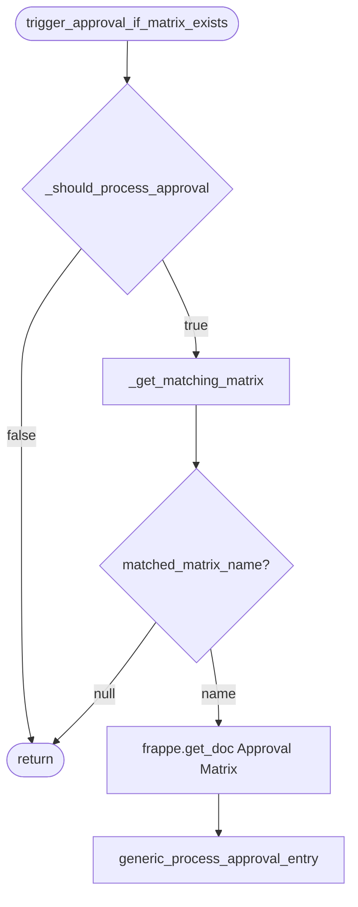
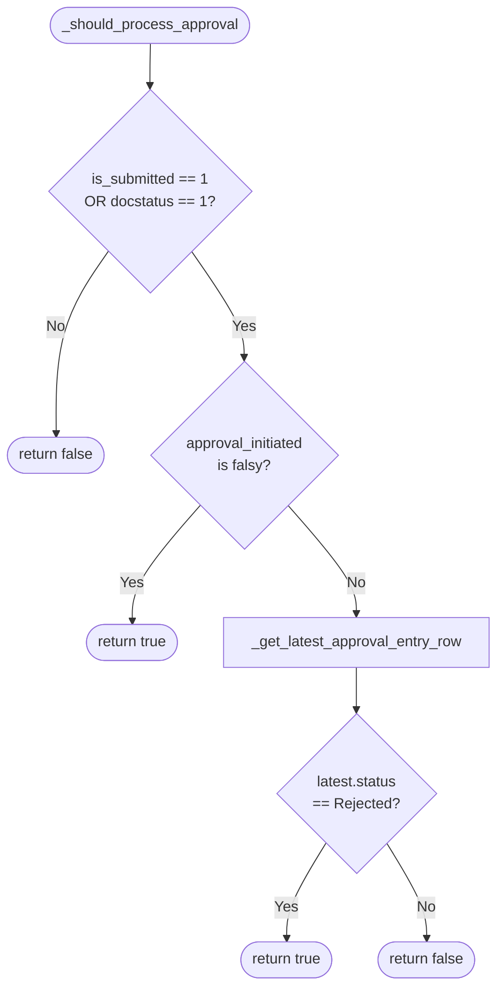
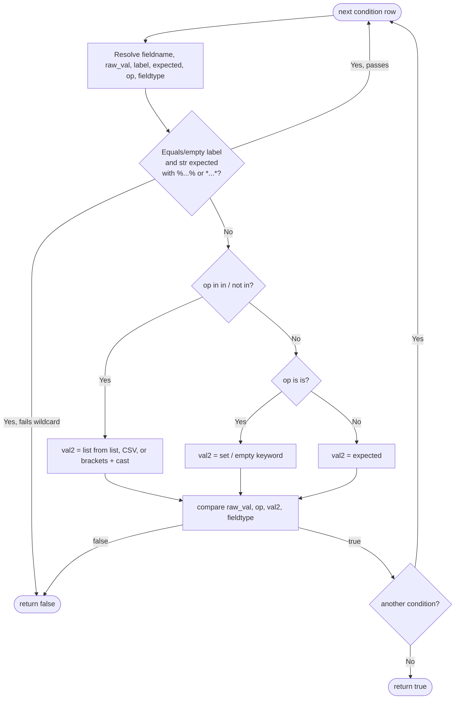
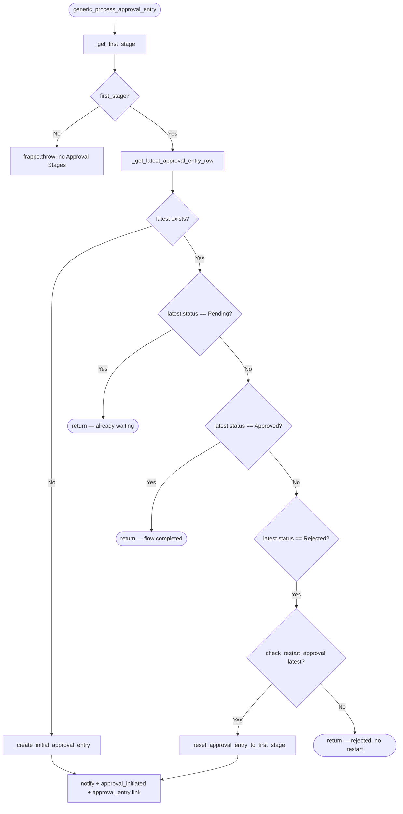
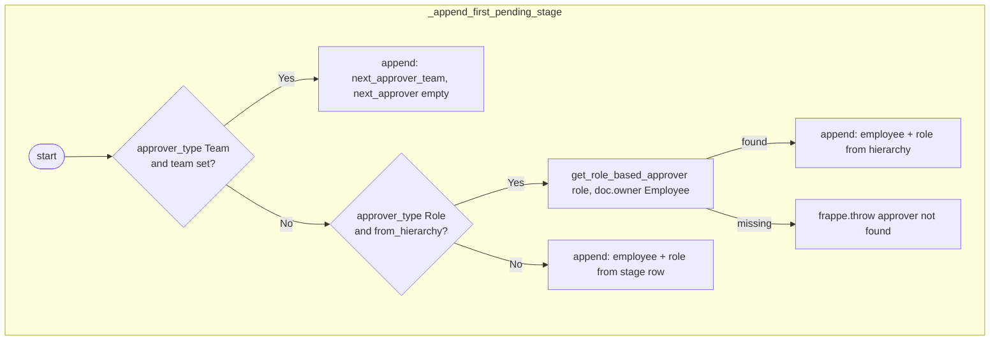
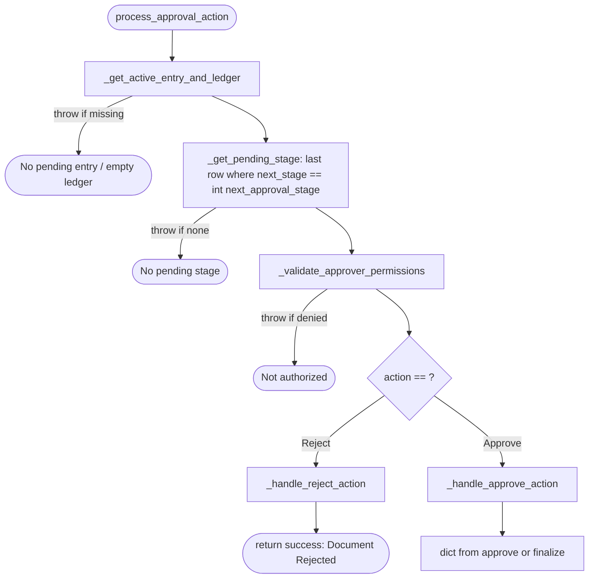
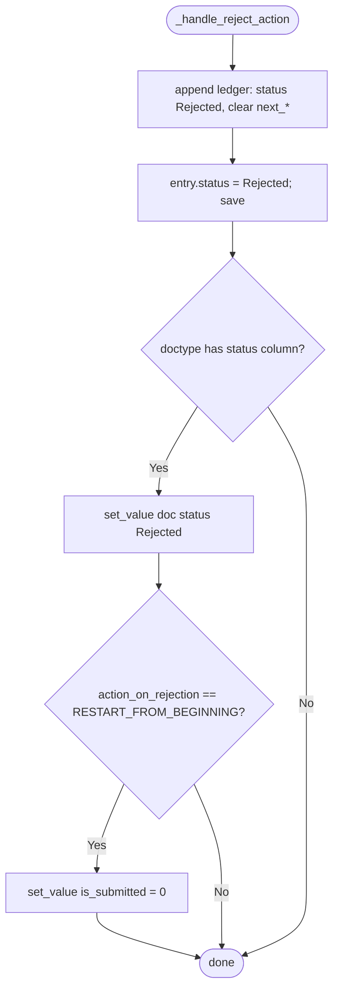
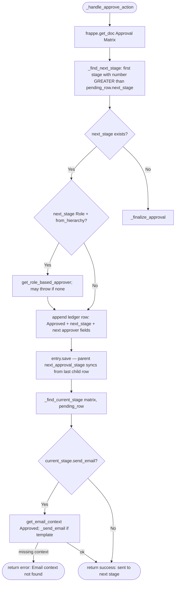
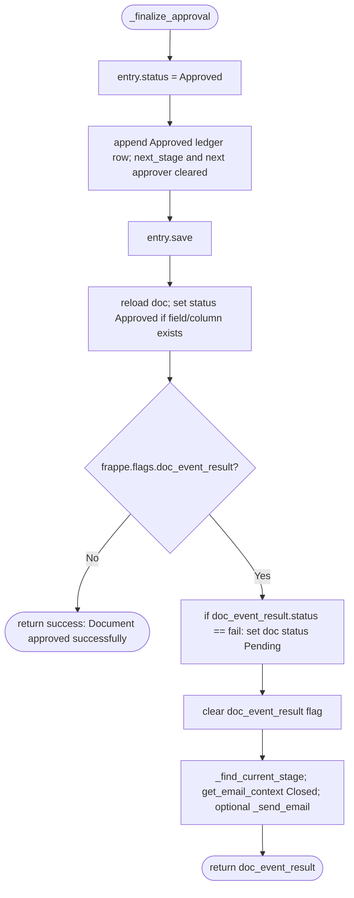
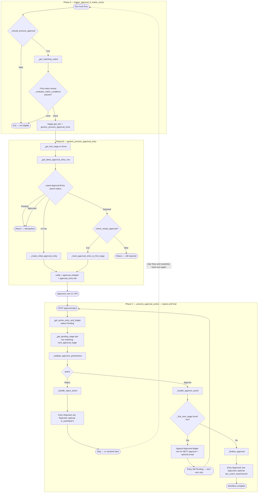

# Dynamic Approval Flow Documentation

## Overview

The dynamic approval flow allows system administrators to configure multi-stage approvals based on dynamic conditions (such as Company Code, Material Group, or Purchase Type) using the **Approval Matrix** and **Approval Entry** doctypes. 

By leveraging this architecture, you don't need to hardcode specific approvers into the codebase. The matrix determines the right approvers sequentially, and the entry ledger tracks the state of the document at each step.

---

## 1. Core Components

### 1.1. Approval Matrix
The `Approval Matrix` Doctype defines *who* needs to approve a document and *when*. 
- **Approval Conditions**: A child table that defines the criteria under which this matrix applies. For example, `conditional_field: "company_code"` with `value: "1000"`. When evaluating a document, these fields are pattern-matched.
- **Approval Stages**: A sequential child table (Stage 1, Stage 2, etc.) defining the `employee` (approver) and their `role` for each step.

### 1.2. Approval Entry
The `Approval Entry` Doctype acts as a transactional ledger for a specific document's approval lifecycle (e.g., Quick Vendor Onboarding or Cart Details).
- This doctype contains links to the `applied_to_doctype` and the `record` (document name/ID).
- **Approval Ledger (Child Table)**: An `approval_entry` child table that logs the step-by-step history:
  - **Pending**: Represents a stage waiting for approval, showing the `next_approver` and `current_stage`.
  - **Approved/Rejected**: A historical log showing who acted (`approved_by`), their `remarks`, and their `status` for past stages.

---

## 2. Standard Workflow & Lifecycle

The lifecycle follows a standard pattern: Triggering ➔ Matching Matrix ➔ Initializing Entry ➔ Processing Decisions ➔ Continuing to Next Stage/Finishing.

### Step 1: Triggering the Flow
When a document is submitted (e.g., `is_submitted` becomes 1), the system checks if the approval has been initiated (using a flag like `approval_initiated`). If not, it invokes `run_approval_matrix(doc)` or equivalent logic.

### Step 2: Evaluating the Matrix
The function `get_approval_matrix(doc)` compares the document's fields against the conditions defined in all `Approval Matrix` records. It returns the matrix that perfectly matches the document's condition fields (like `company_code`).

### Step 3: Initializing the Approval Entry
If a matching matrix is found, `process_approval_entry()` is triggered:
1. It looks up the **First Stage** from the matched `Approval Matrix`'s stages.
2. A new `Approval Entry` document is created, linking the original document with the matrix.
3. A row is appended to the `Approval Entry` child table with a status of **Pending**, keeping track of the `current_stage` (e.g., 0) and the `next_approver`.
4. The system updates the original document with the `Approval Entry` link (or references it) and dispatches email notifications to the `next_approver`.

### Step 4: Processing the Approver's Action
When the designated approver reviews the record, they execute an action (`Approve` or `Reject`) accompanied by `remarks`. This usually happens via an API endpoint (e.g., `accounts_team_approval` or `purchase_approval_check`).

1. **Validation**: Before accepting the decision, the API calls `_validate_approval_step(approval_entry, approver_email)`. This securely ensures:
   - The user taking the action is strictly the designated `next_approver`.
   - The current step hasn't already been addressed (to prevent replay attacks or parallel submissions).
   
2. **On Rejection**:
   - A new row is appended to the `Approval Entry` child table with the status **Rejected** and the `remarks`.
   - The original document's status is updated to "Rejected," email notifications are dispatched, and the flow completely stops.

3. **On Approval**:
   - A new row is appended with the status **Approved**, saving the `remarks` and `approved_by` user.
   - The script determines the `current_stage` and advances it depending on the `Approval Matrix`.
   - `trigger_next_stage(doc, approval_entry)` is called to evaluate if there is a subsequent stage available in the matrix:
     - **Continuing down the matrix**: If there is another stage, a new **Pending** row is added to the `Approval Entry` ledger for the newly identified `next_approver`, and notifications are sent out.
     - **Completing the flow**: If there are no more active stages listed in the matrix, the document is officially marked as **Approved**. This subsequently triggers post-approval scripts (such as auto-syncing with SAP in the vendor onboarding flow).

---

## 3. Implementation Guide for New Doctypes

If you plan to integrate this dynamic flow into a new module, ensure you follow this checklist:

1. **Required Fields**: 
   - Add flag fields like `status` (Select/Data), `is_submitted` (Check), and `approval_initiated` (Check) to track the state. For dynamic routing on child lines (like Cart Product rows), add these flags on the child doctype itself.
   - Add an `approval_entry` Link field to easily connect your base document to the tracking doctype.
   
2. **Event Trigger (`on_update` / `on_submit`)**:
   - Listen to changes and watch for the submission flag to become true. Once true, trigger `run_approval_matrix()` and explicitly define the condition fields.

3. **Approver Action API**:
   - Build a Frappe whitelist wrapper to accept the approver's payload from the frontend (`action` and `remarks`).
   - Fetch the active `Approval Entry` for the relevant document.

4. **Validating & Proceeding**:
   - Invoke `_validate_approval_step()` within the API wrapper to verify identity safely.
   - For Approvals, log the new stage tracking row and run the generic `trigger_next_stage()` function so the loop correctly continues up the matrix or ends favorably.

5. **Approval Flow Diagram**:

      [Start: Document Submitted]
                  │
                  ▼
      [Check approval_initiated?]
                   │
            ┌──────┴──────┐
            │             │
            Yes            No
            │             ▼
            │   [Run Approval Matrix (if eligible)]
            │             │
            │             ▼
            │   [Find Matching Matrix]
            │             │
            │             ▼
            │   [Create/Reset Approval Entry]
            │             │
            │             ▼
            │   [Set Stage 1 as Pending]
            │             │
            │             ▼
            │   [Notify First Approver(s)]
            │
            ▼
        [Wait for Approver Action]
                    │
                    ▼
        [Get Active Approval Entry & Ledger]
                    │
                    ▼
        [Get Latest Pending Stage]
                    │
                    ▼
        [Validate Approver Permissions / Identity]
                   │
            ┌──────┴────────────────────────────┐
            │                                   │
        [Rejected]                          [Approved]
            │                                   │
            ▼                                   ▼
      [Append Rejected Ledger Row]  [Append Approved Ledger Row]
            │                                   │
      [Set Status: Rejected]                    │
            │                                   │
      [Update Linked Doc                        │
       Status: Rejected]                        │
            │                                   │
      [Set is_submitted = 0                     │
       if Restart Policy]                       │
            │                                   │
      [Send Rejection Email]                    │
            │                                   │
        [Stop Flow]                 [Sync next_approval_stage
                                        from child row]
                                                │
                                                ▼
                                        [Send Approval Email
                                            (if configured)]
                                                │
                                                ▼
                                    [Check Next Stage Exists?]
                                                │
                                        ┌───────┴────────┐
                                        │                │
                                        Yes              No
                                        │                │
                                        ▼                ▼
                                [Set Next Stage Pending]  [Mark Final Approved]
                                [Notify Next Approver(s)] [Set Linked Doc Status: Approved]
                                        │                [Post-Approval Doc Event?]
                                        ▼                [Send Closed/Final Email if needed]
                                (Loop continues)          [Return Success or Error]
 

---

## 4. Approval Router (`approval_router.py`) — End-to-End Implementation

This section documents the **actual** functions and control flow in `vms/approval/approval_router.py`. Names in [Section 2](#2-standard-workflow--lifecycle) are conceptual; here they map one-to-one to code.

### 4.1. Constants and shared behavior

| Symbol | Role |
|--------|------|
| `RESTART_FROM_BEGINNING` | String value compared to `Approval Matrix.action_on_rejection`. When rejection handling sets this, the source document can be unsubmitted (`is_submitted` → 0) so the user can fix and resubmit. |
| `_CONDITION_LABEL_TO_OPERATOR` | Maps UI labels on matrix conditions (`Equals`, `Not Equals`, `Like`, `In`, `Not In`, `Is`, etc.) to operators understood by `frappe.utils.compare()`. |

The child ledger table field is resolved at runtime: **`approval_ledger`** if present on `Approval Entry`, otherwise **`approval_entry`**.

### 4.2. Phase A — DocEvent trigger (start of flow)

**Entry point:** `trigger_approval_if_matrix_exists(doc, method=None)`  
Intended to be wired from a DocType hook (`on_update`, `on_submit`, or both).

**`_should_process_approval(doc)`** — decision tree (same order as code):

**`_should_process_approval(doc)`** returns true only when:

1. The document is considered submitted: `is_submitted == 1` **or** `docstatus == 1`.
2. **Either** `approval_initiated` is not set (first run), **or** the latest **`Approval Entry` document** (by `modified`, for this `record` + `applied_to_doctype`) has `status == "Rejected"`.

If `approval_initiated` is set and that latest **Approval Entry** is still **Pending** or **Approved**, processing is skipped to avoid duplicate runs.

**`_get_matching_matrix(doc)`** lists `Approval Matrix` names where `applies_to_doctype == doc.doctype`, then returns the **first** name whose loaded matrix passes `_evaluate_matrix_conditions`, or `None` if none match.

**`_evaluate_matrix_conditions(doc, matrix)`** — for each row: resolve field metadata, apply legacy `%` / `*` “contains” on plain `Equals` when applicable, build `val2` for `in` / `not in` / `is`, then `compare()`. Any failed row fails the whole matrix.

**`_evaluate_matrix_conditions`** — one iteration per `matrix.conditions` row (all must pass):

### 4.3. Phase B — Initialize or extend `Approval Entry`

**Entry point:** `generic_process_approval_entry(doc, approval_matrix)`  
`_get_latest_approval_entry_row` returns the **most recently modified `Approval Entry` document** for `record` + `applied_to_doctype` (fields `name`, `status`, `approval_matrix`) — not a child ledger row.

**`_append_first_pending_stage`** (first row only; mutually exclusive branches in code):

**First stage:** `_get_first_stage` reads `approval_matrix.stages` or `approval_matrix.approval_stages` and returns the first row that has at least one of `employee`, `role`, or `team`.

**New document path — `_create_initial_approval_entry`:**

1. Creates `Approval Entry` with `status=Pending`, `applied_to_doctype`, `record`, `approval_matrix`.
2. `_append_first_pending_stage` appends one ledger row with `status=Pending`, `current_stage=0`, and `next_stage` from the stage row. Behavior by `approver_type`:
   - **Team:** `next_approver_team` set; individual approver may be empty.
   - **Role** with **`from_hierarchy`:** `get_role_based_approver` walks `Employee.reports_to` from the document owner’s employee until a user with that role is found; ledger stores resolved `employee` / `role`.
   - **Otherwise:** `next_approver` / `next_approver_role` from the stage row.
3. `insert(ignore_permissions=True)`.
4. `_notify_first_stage_if_configured` if the matrix has `send_email_alert` and `email_template`.
5. `_set_doc_approval_initiated_and_link` sets `approval_initiated=1` and `approval_entry` on the source document when those fields exist.

**After rejection — `_reset_approval_entry_to_first_stage`:** When the latest **`Approval Entry` document** for the record has `status == "Rejected"` and `check_restart_approval` is true (matrix `action_on_rejection == RESTART_FROM_BEGINNING`), that same entry is reopened: `status=Pending`, matrix relinked, a new first-stage **Pending** row appended, notifications sent, and doc flags updated. Prior ledger rows remain as history.

> **Sync with parent fields:** `Approval Entry`’s `on_update` / `after_insert` (`approval_entry.py`) copy the **last** child row into header fields such as `next_approval_stage`, `next_approver`, etc., when the child table is named `approval_entry`. Customizations using only `approval_ledger` should keep that behavior aligned.

### 4.4. Phase C — Approver action API

**Entry point:** `@frappe.whitelist` `process_approval_action(doctype, doc_name, action, remarks="")` (POST). Errors are logged and rethrown via `frappe.throw`.

**`_handle_reject_action`** (detail):

**`_handle_approve_action`** (detail — intermediate vs final):

**`_finalize_approval`** (last approver):

**`_get_active_entry_and_ledger`:** Loads the `Approval Entry` with `status == "Pending"` for `applied_to_doctype` + `record`, resolves the ledger table name, and loads child rows.

**`_get_pending_stage(ledger_items, next_stage)`:** Finds the **last** ledger row whose `next_stage` equals `int(entry.next_approval_stage)`. That row identifies the current step (including the initial **Pending** row, and after intermediate approvals the **Approved** row that carries the next approver — see below).

**`_validate_approver_permissions(pending_row)`:** The session user may act if:

- Their **Employee** matches `next_approver`, or  
- They have `next_approver_role`, or  
- Their **Employee** belongs to `next_approver_team`, or  
- User is `Administrator`.

Otherwise `frappe.throw` with a clear message.

**Reject — `_handle_reject_action`:**

- Appends a ledger row: `action`/`status` **Rejected**, `approved_by`, `approver_user`, `remarks`, clears next approver fields.
- Sets `Approval Entry.status = "Rejected"` and saves.
- If the source doctype has a `status` column, sets document `status` to **Rejected**.
- If `Approval Matrix.action_on_rejection == RESTART_FROM_BEGINNING`, sets `is_submitted` to **0** on the source document so it can be edited and resubmitted.

**Approve — `_handle_approve_action`:**

1. Loads the matrix; `_find_next_stage(matrix, pending_row)` returns the next stage row with a **greater** stage number than the current `pending_row.next_stage`, or `None` if this was the last stage.
2. **If there is a next stage:** Resolves hierarchy for **Role** + `from_hierarchy` if needed. Appends a ledger row with `status` **Approved** (and `action`: **Approved**) that records the acting user and **also** sets `next_stage`, `next_approver`, `next_approver_role`, `next_approver_team` for the **upcoming** stage. Saves. If the **current** stage row has `send_email` and an `email_template`, sends mail to the next approver/team via `get_email_context` and `_send_email`. Returns a success message for “sent to next stage.”
3. **If there is no next stage:** Delegates to `_finalize_approval`.

**Important:** Multi-step progression does **not** always add a separate **Pending** child row for “stage 2 waiting.” The **Approved** row appended when leaving a stage carries the next stage number and next approver; `Approval Entry.next_approval_stage` is updated from the **last** child row on save. The first stage still begins with an explicit **Pending** row from `_append_first_pending_stage`.

**Finalize — `_finalize_approval`:**

- Sets `Approval Entry.status = "Approved"`.
- Appends a final **Approved** ledger row (when `ledger_table` and `pending_row` are passed) with no further next approver.
- Sets the source document `status` to **Approved** if applicable.
- If `frappe.flags.doc_event_result` indicates a downstream `doc` event **failed**, the source document may be set back to **Pending** and a “Closed” email can be sent; flags are cleared afterward.
- Otherwise returns success.

**Email — `_send_email`:** Loads `Email Template`, renders subject/body with `frappe.render_template`, sends via `frappe.sendmail` (recipients from context, with a code fallback).

### 4.5. Other public helpers in this module

| Function | Purpose |
|----------|---------|
| `get_role_based_approver(role, starting_employee, max_depth=10)` | Walks `Employee.reports_to` from a starting employee (or session user’s employee) until a user with `role` is found; returns `employee`, `user`, `role`. |
| `can_approve(doctype, doc_name)` | Whitelist: whether the current user may approve, using the **last** ledger row (team vs employee vs role vs Administrator). |
| `can_approve_entry(approval_entry)` | Whitelist API endpoint (`/api/method/vms.approval.approval_router.can_approve_entry`): Check if the current session user can approve the document directly using a specific `Onboarding` ID. |
| `get_approval_status(approval_entry)` | Human-readable string from an `Approval Entry` name (pending / team / role / rejected). **Note:** implementation assumes the `approval_entry` child table name for the last row. |
| `fetch_team_members(team)` | Returns `user_id` list for `Employee` with that `team`. |
| `check_restart_approval(entry)` | True if the entry’s matrix has `action_on_rejection == RESTART_FROM_BEGINNING`. |
| `revert_approval_status(entry)` | Sets entry `Pending` and **pops** the last child row from `approval_entry` only (use with care; may not match `approval_ledger`). |
| `get_approval_entry(doctype, doc_name)` | Returns the `Approval Entry` document for the pair (not filtered by Pending). |

**Unused in-router helper:** `_add_next_pending_stage` is defined but not called from this file; next-stage handling is done via the **Approved** row + parent field sync described above.

### 4.6. Master flowchart (start to finish)

This diagram ties **Phase A → B → C** together. Matrix matching stops at the **first** passing matrix. Initialization **returns early** if an `Approval Entry` already exists with status **Pending** or **Approved**. After a **Reject** without restart, initialization does nothing until the document changes state elsewhere.

**Intermediate approvals:** `Approval Entry` stays **`status = Pending`** until `_finalize_approval` runs on the **last** stage; only the **child ledger** rows record each **Approved** step and carry the **next** approver.

---

### Cross-reference: conceptual vs `approval_router` names

| Concept (Section 2) | `approval_router.py` |
|---------------------|----------------------|
| Run approval matrix | `trigger_approval_if_matrix_exists` → `_get_matching_matrix` |
| Find matching matrix | `_get_matching_matrix` + `_evaluate_matrix_conditions` |
| Create / init entry | `generic_process_approval_entry`, `_create_initial_approval_entry`, `_reset_approval_entry_to_first_stage` |
| Approver API | `process_approval_action` |
| Validate approver | `_validate_approver_permissions` |
| Next stage / final | `_handle_approve_action`, `_find_next_stage`, `_finalize_approval` |

---

### 4.7. Vendor Onboarding Specific Wrappers (`approvals.py`)

For the `Vendor Onboarding` doctype, the frontend APIs are consolidated into a single wrapper function `process_onboarding_approval(data, stage)` located in `vms/APIs/vendor_onboarding/approvals.py`.

This function serves as an unauthenticated gateway (using `@frappe.whitelist(allow_guest=True)`) that:
1. Impersonates the appropriate user via `frappe.set_user(user)`.
2. Handles domain-specific pre-approval logic (e.g., uploading `bank_proof_by_purchase_team` files for the Purchase Team, or updating the `reconciliation_account` for Accounts Teams).
3. Delegates the actual ledger and tracking updates to the core `process_approval_action` router.

The frontend still calls the historical, dedicated API endpoints (`purchase_team_check`, `accounts_team_check`, `purchase_head_check`, `accounts_head_check`), which now all pass their respective stage identifier to the central wrapper to dramatically reduce code duplication.